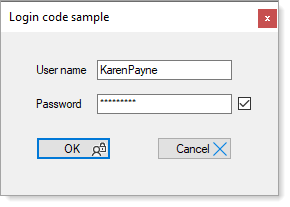

# SQL-Server Secure User login

### Introduction

Usually opening a `Microsoft SQL-Server database` involves no security for small personal applications while professional workplace applications utilize Windows authentication for Windows Form application. 

This article will provide code for developers who want their users to perform a login by providing a user name and associated password each time there is a need to access data within a database. 



#### 07/24/2021

:heavy_check_mark: Changed server name for connection string

:heavy_check_mark: Added several images

#### 12/2020

:heavy_check_mark:  Modified SqlCredentialLoginInterface to include user and role table

**Option 1**
```csharp
public SqlServerLoginResult SqlCredentialLogin(byte[] pNameBytes, byte[] pPasswordBytes)
{
    var loginResult = new SqlServerLoginResult();
    var secureOperations = new Encryption();

    var userName = secureOperations.Decrypt(pNameBytes, "111");
    var userPassword = secureOperations.Decrypt(pPasswordBytes, "111");

    string connectionString = $"Data Source={serverName};" + 
                              $"Initial Catalog={catalogName};";


    var securePassword = new SecureString();

    foreach (var character in userPassword)
    {
        securePassword.AppendChar(character);
    }

    securePassword.MakeReadOnly();

    var credentials = new SqlCredential(userName, securePassword);

    using (var cn = new SqlConnection {ConnectionString = connectionString})
    {
        try
        {
            cn.Credential = credentials;
            cn.Open();
            loginResult.Success = true;
        }

        catch (SqlException failedLoginException) when (failedLoginException.Number == 18456)
        {
            loginResult.Success = false;
            loginResult.GenericException = false;
            loginResult.Message = "Can not access data.";
        }
        catch (SqlException genericSqlException)
        {
            loginResult.Success = false;
            loginResult.GenericException = false;
            loginResult.Message = "Can not access data.";
        }
        catch (Exception ex)
        {
            loginResult.Success = false;
            loginResult.GenericException = true;
            loginResult.Message = ex.Message;
        }

    }

    return loginResult;

}
```
**Option 2**
```csharp
public SqlServerLoginResult Login(byte[] pNameBytes, byte[] pPasswordBytes)
{
    var loginResult = new SqlServerLoginResult();

    var secureOperations = new Encryption();
    var userName = secureOperations.Decrypt(pNameBytes, "111");
    var userPassword = secureOperations.Decrypt(pPasswordBytes, "111");


    string ConnectionString =
        $"Data Source={serverName};" +
        $"Initial Catalog={catalogName};" +
        $"User Id={userName};Password={userPassword};" +
        "Integrated Security=False";

    using (var cn = new SqlConnection { ConnectionString = ConnectionString })
    {
        try
        {
            cn.Open();
            loginResult.Success = true;
        }
        catch (SqlException failedLoginException) when (failedLoginException.Number == 18456)
        {
            loginResult.Success = false;
            loginResult.GenericException = false;
            loginResult.Message = "Can not access data.";
        }
        catch (SqlException genericSqlException)
        {
            loginResult.Success = false;
            loginResult.GenericException = false;
            loginResult.Message = "Can not access data.";
        }
        catch (Exception ex)
        {
            loginResult.Success = false;
            loginResult.GenericException = true;
            loginResult.Message = ex.Message;
        }
    }

    return loginResult;

}
```

C# version [Microsoft TechNet article](https://social.technet.microsoft.com/wiki/contents/articles/53316.sql-server-database-login-for-windows-forms-c.aspx).

VB.NET version [Microsoft TechNet article](https://social.technet.microsoft.com/wiki/contents/articles/53314.sql-server-database-login-for-windows-forms-vb-net.aspx).


#### 07/26/2021

If a requirement is to show the login form after closing the main form.

In the project `SqlCredentialLoginInterface`.

In MainForm, comment out

```csharp
private void MainFormClosed(object sender, FormClosedEventArgs e)
{
    Application.ExitThread();
}
```

In the login form change

```csharp
if (results.Success)
{
	Hide();
	var mainForm = new MainForm(userNameBytes, passwordBytes);
	mainForm.ShowDialog();
}
else
{
	MessageBox.Show(results.Message);
}
```

To

```csharp
if (results.Success)
{
	Hide();
	var mainForm = new MainForm(userNameBytes, passwordBytes);
	mainForm.ShowDialog();
    Close();
}
else
{
	MessageBox.Show(results.Message);
}
```